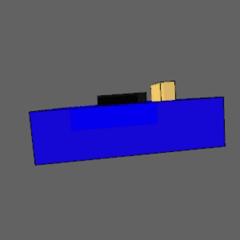
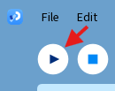

# Digital Twin
The intention of this code is to allow a 3D graphic to show the position of the device as it operates.

It will determine this position from the orientation of the accelerometer/gyroscope units. At the time of writing, these are MPU-6050s.

## Current Status
As of Jan. 16, 2026, the position/orientation of a single MPU unit can be displayed.



## How to Use it
First, open `printQuats/printQuats.ino`. You will see in that code that there's definitions for sensor biases near the top. It is recommended that these be customized. There's a print statement in there that you can uncomment to see what the unadjusted output values are to help you find good bias values.

```.c
// TODO: Update these as appropriate for your specific MPU
#define BIAS_GYRO_X 0.026
#define BIAS_GYRO_Y -0.034
#define BIAS_GYRO_Z 0.025
```

If they aren't already installed, you'll need the Adafruit MPU-6050 Arduino library and its prerequisites.

From there, wire the MPU-6050 to your ESP-32, then compile & upload the code to the microcontroller.

If you don't have the Processing IDE installed, you can download it from [processing.org](https://processing.org/). You will also need its ToxicLibs libraries installed. They can be downloaded [here](https://github.com/postspectacular/toxiclibs/releases/tag/0021) and then extracted into the `libraries` directory of your Processing installation.

Now, open the Processing IDE, go to File>Open, and select `display/display.pde`. Then, just click run.



That should do it, but if you're having troubles, try unplugging and reconnecting the ESP-32 from the computer (and any other power source if it's connected to one). I've found this to fix anything I've encountered, but note that a simple press of the RESET button isn't enough usually.

## Next Steps
- Allow for multiple sensors to be read from and used to display animation components (each leg has 2)
- Get initial position of each sensor (via gravity vector probably) before program really gets going. This will allow us to find the relative angle between two sensors instead of having to assume their starting positions
- Design animation components for each section of the leg that is being tracked
- Connect the components of each leg together and animation constraints such they behave in animation as they do in the real world
- Integrate the `.ino` code into the main system code so that we can monitor the leg during actual use

